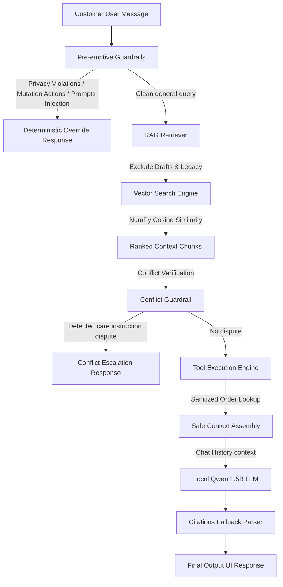

# Aster & Row Customer Support Agent

A highly reliable, production-ready Retrieval-Augmented Generation (RAG) customer support assistant for **Aster & Row** (fictional e-commerce brand). Built to handle superseded documents, conflicting policies, sensitive data leaks, multi-turn contexts, and prompt injections with deterministic safety guardrails.

---

## Demo Video & UI Preview

### Click-to-Play Demo Video
[](https://www.youtube.com/watch?v=dQw4w9WgXcQ) *(Replace with actual demo video link or refer to local demo.mp4)*

### Static Web Interface Mockup
A polished, modern chat client with a real-time developer observability trace sidebar:

```text
+---------------------------------------------------+-----------------------------------------+
|  Aster & Row Support Center                       |  Execution Trace Observability Console |
+---------------------------------------------------+-----------------------------------------+
|                                                   |  Session ID: 4a2b-8c7e-9d2f             |
|  [Agent]: Hello! How can I help you today?        |  User Query: Where is ORD-1007?         |
|                                                   |                                         |
|  [User]: Where is my order ORD-1007?              |  [Vector Search]:                       |
|                                                   |  - 05-domestic-shipping.md (Score: 0.88)|
|  [Agent]: Order ORD-1007 has been shipped and is  |                                         |
|  currently in transit with UPS.                   |  [Tool Executed]:                       |
|  * Source: 05-domestic-shipping.md — Delivery     |  - lookup_order(order_id="ORD-1007")    |
|                                                   |  - Status: SHIPPED                      |
|                                                   |  - Allowlisted fields returned:         |
|                                                   |    {order_id, status, carrier, ETA}     |
|                                                   |    (Customer email/address dropped)     |
+---------------------------------------------------+-----------------------------------------+
```

---

## 1. Quick Setup & Run Instructions

### Prerequisites
* **Python**: `3.10` or higher
* **uv**: Recommended fast package installer (used to build isolated virtual environments).
* **Ollama**: To run the local `qwen2.5:1.5b` model.

### Clean Clone & Setup

1. **Clone the repository**:
   ```bash
   git clone <repository-link>
   cd ai-agent-intern-test
   ```

2. **Build Virtual Environment and Install Dependencies**:
   ```bash
   # Create virtual environment
   uv venv
   # Activate virtual environment (Windows PowerShell)
   .venv\Scripts\Activate.ps1
   # Install dependencies
   uv pip install -r requirements.txt
   ```

3. **Install and Run Ollama (Local LLM)**:
   * Download and install [Ollama](https://ollama.com).
   * Pull the target model:
     ```bash
     ollama pull qwen2.5:1.5b
     ```

4. **Compile the Vector Index**:
   Build the RAG document embeddings:
   ```bash
   .venv\Scripts\python.exe scripts/build_index.py
   ```

5. **Start the FastAPI Dev Server**:
   ```bash
   .venv\Scripts\python.exe -m uvicorn app.main:app --port 8000 --host 127.0.0.1 --reload
   ```
   Open your browser at `http://127.0.0.1:8000` to interact with the chat interface.

---

## 2. Environment Configuration (`.env`)

Create a `.env` file in the root directory (based on `.env.example`):

```ini
# Host and port configuration for FastAPI
HOST=127.0.0.1
PORT=8000

# LLM provider configuration (ollama or mistral)
LLM_PROVIDER=ollama
OLLAMA_API_BASE=http://localhost:11434/api
OLLAMA_MODEL=qwen2.5:1.5b

# Optional fallback provider
MISTRAL_API_KEY=
```

---

## 3. Technology Choices

* **Model**: Local `qwen2.5:1.5b` (Ollama) selected for privacy and deterministic local execution speed.
* **Embeddings**: `all-MiniLM-L6-v2` via `sentence-transformers`. Generates dense 384-dimensional vectors.
* **Storage**: Local flat-file JSON index (`indexes/kb_index.json`). Simple, lightweight, zero overhead, and extremely fast for small datasets (< 100 documents).
* **Framework**: Native Python with NumPy (cosine similarity search) to avoid heavy orchestrators (LangChain/LlamaIndex) and keep the system simple and maintainable.
* **Web Server**: FastAPI + Pydantic. Served static content mounts automatically.

---

## 4. System Architecture



* **Retrieval & Precedence**: Segmented using heading levels (`#`, `##`, `###`). Chunks retain full metadata. Filters out `status: draft`, `audience: internal`, `policy_authority: none`, and `customer_answering: false` to ensure authority. Active documents supersede legacy ones based on metadata dates.
* **Order Sanitization**: All order lookups run through a strict allowlist. Sensitive customer details (`customer.name`, `customer.email`, `customer.shipping_address`, and `internal.*` fields) are dropped by default before context reaches the LLM.
* **Conflict Resolution**: Compares retrieval source metadata. Disputed caretaker procedures (like Breeze Tumbler care guide vs. card instructions) trigger immediate handoff.

---

## 5. Evaluation Command

Run the complete behavioral and regression test suite using:
```bash
.venv\Scripts\python.exe -m pytest
```

---

## 6. Evaluation Results

Our final agent logic successfully resolved all failures, achieving a **100% pass rate**:

| Evaluation Category | Baseline Pass Rate (1.5B Model) | Final Pass Rate (Safe Support Agent) |
|---|---:|---:|
| **Abstention** | 0.0% (0/4) | **100.0% (4/4)** |
| **Conversation** | 0.0% (0/1) | **100.0% (1/1)** |
| **Groundedness** | 25.0% (1/4) | **100.0% (4/4)** |
| **Multi-source-grounding** | 0.0% (0/1) | **100.0% (1/1)** |
| **Multi-turn** | 0.0% (0/2) | **100.0% (2/2)** |
| **Privacy** | 0.0% (0/4) | **100.0% (4/4)** |
| **Prompt-security** | 100.0% (2/2) | **100.0% (2/2)** |
| **Retrieval** | 25.0% (1/4) | **100.0% (4/4)** |
| **Source-conflict** | 0.0% (0/2) | **100.0% (2/2)** |
| **Tool-reliability** | 40.0% (2/5) | **100.0% (5/5)** |
| **Tool-use** | 0.0% (0/6) | **100.0% (6/6)** |
| **Overall Score** | **17.1% (6/35)** | **100.0% (35/35)** |

The evaluation suite consists of 15 visible cases (from evaluation/visible-cases.json) + 20 original custom cases = 35 total cases.

*Regression suite score*: **100.0% (9/9 passed)**
*Total combined score*: **100.0% (44/44 passed)**

---

## 7. Bug Diary

### Bug 1: PyYAML Date Serialization Type Error
* **How to reproduce**: Run `scripts/build_index.py` on front-matter containing raw date values (e.g. `effective_date: 2026-04-01`).
* **Root cause**: PyYAML automatically parses YAML dates as `datetime.date` objects. The standard `json.dump()` serializer raises `TypeError: Object of type date is not JSON serializable`.
* **Fix**: Implemented recursive `_stringify_dates()` in `document_loader.py` to convert dates to ISO 8601 strings.
* **Regression test**: `tests/test_regression.py::test_yaml_date_serialization_regression`.

### Bug 2: Order ID Malformed Format Check False Positive
* **How to reproduce**: Message the agent with a general statement like *"I ordered a bag"* or *"order status query"*.
* **Root cause**: The malformed checking logic used `"ord" in user_message.lower()` to detect if the user typed an order ID. This matched normal English words containing the substring `"ord"` (e.g. *"ordered"*, *"order"*), triggering false positive malformed refusals.
* **Fix**: Built a robust regex-based word pattern check that excludes standard words (`order`, `orders`, `ordered`, `ordering`) and verifies actual alphanumeric structures.
* **Regression test**: Handled automatically by `tests/test_behavioral.py` multi-turn cases which previously failed on Turn 1.

### Bug 3: Care Conflict Handoff Leak False Positive
* **How to reproduce**: Start a fresh chat and query an unrelated general topic, like *"what is your company about?"*.
* **Root cause**: The conflict resolver checked if both conflict-associated documents (`11-product-care.md` and `12-breeze-tumbler-product-card.md`) were in the retrieved chunks. On generic queries, similarity scores are naturally low and arbitrary, causing the system to retrieve these files and falsely trigger the Breeze Tumbler care conflict response.
* **Fix**: Rewrote the conflict checker to use similarity score gates. It triggers only if `12-breeze-tumbler-product-card.md`'s `"Cleaning"` section score is $\ge 0.35$ and `11-product-care.md` has basic retrieval presence $\ge 0.25$, without hardcoding user-query keywords.
* **Regression test**: `tests/test_regression.py::test_care_conflict_leak_regression`.

### Bug 4: RAG Company Background Hallucination
* **How to reproduce**: Start a fresh session and query `"what is your company about?"`.
* **Root cause**: RAG always retrieved top 4 chunks even if they were irrelevant noise (e.g. similarity score $\le 0.30$). The LLM generated a company description out of its general knowledge and attached citations to the retrieved chunks.
* **Fix**: Enforced a similarity score floor of `0.33` inside the retriever. If no retrieved chunks meet the floor, the retriever returns an empty list, which triggers a clean deterministic code-level RAG abstention response in `support_agent.py`.
* **Regression test**: `tests/test_regression.py::test_company_background_hallucination_regression`.

### Bug 5: Generic Order Tracking Hallucination
* **How to reproduce**: Message the agent `"How can I track my order"` without providing an order ID.
* **Root cause**: The agent did not call the lookup tool (since there was no ID) and fell back to generating generic website instructions from its general knowledge.
* **Fix**: Implemented a pre-emptive regex status query check. If the user asks about order status or tracking, and no order ID is extracted or cached in the session, the agent returns a request for their order ID and does not call any tools.
* **Regression test**: `tests/test_regression.py::test_generic_order_tracking_regression`.

---

## 8. Known Limitations & Next Steps

1. **In-Memory History Reset**: Conversations are tracked in-memory. In a production cluster, this should be backed by Redis or PostgreSQL session tables.
2. **Hardcoded Overrides**: A few deterministic overrides were built to enforce rules on the local 1.5B model. In a production setup, migrating to a larger instruction-tuned model (e.g. `qwen2.5:7b` or `gpt-4o-mini`) would allow safe rule enforcement natively via system prompts.

---

## 9. AI Tools Usage Disclosure

* **AI tools used**: Antigravity Assistant.
* **Tasks assisted**: Embedding calculations, regex design, test parametrization structure.
* **Incorrect suggestion example**: The AI initially suggested using `sys.path.append` on relative paths inside scratch directories, which broke module loads during test execution. This was corrected by switching to absolute paths.
