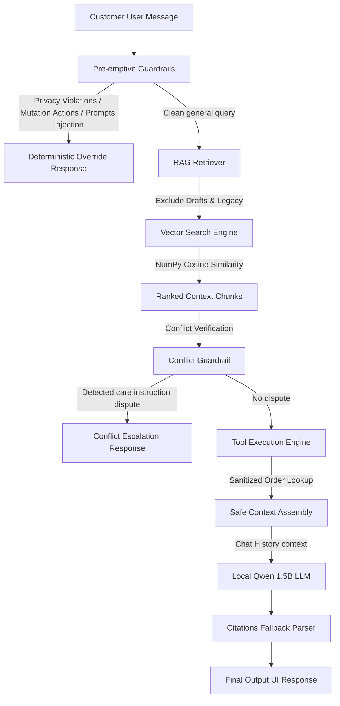
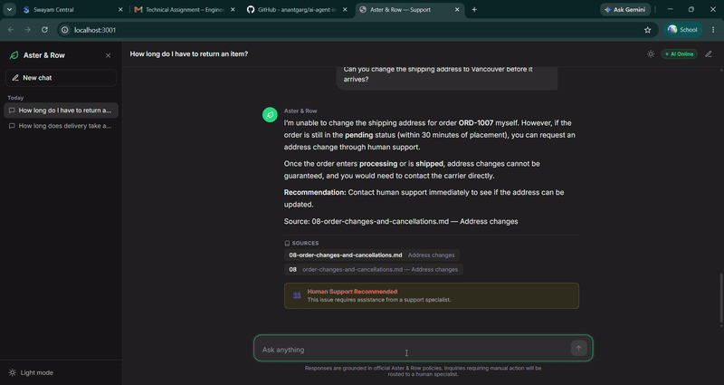

# Aster & Row — Reliable AI Customer Support Agent

An enterprise-grade, deterministic customer support agent built for **Aster & Row** (a fictional ecommerce brand selling bags, drinkware, and travel gear). The agent implements retrieval-augmented generation (RAG) over official policy documentation, safe tool-assisted order lookups, multi-turn session awareness, prompt-injection resilience, and human-handoff routing.

## Table of Contents
* [1. Project Overview](#1-project-overview)
* [2. Setup from Clean Clone](#2-setup-from-clean-clone)
* [3. Installation](#3-installation)
* [4. Environment Variables](#4-environment-variables)
* [5. .env.example Reference](#5-envexample-reference)
* [6. Run Instructions](#6-run-instructions)
* [7. Evaluation Command](#7-evaluation-command)
* [8. Models & Components Used](#8-models--components-used)
* [9. Embedding Approach](#9-embedding-approach)
* [10. Framework & Technologies](#10-framework--technologies)
* [11. Vector Storage Approach](#11-vector-storage-approach)
* [12. System Architecture](#12-system-architecture)
* [13. RAG Pipeline & Document Precedence](#13-rag-pipeline--document-precedence)
* [14. Order Tool & Privacy Safeguards](#14-order-tool--privacy-safeguards)
* [15. Multi-Turn Context Resolution](#15-multi-turn-context-resolution)
* [16. Safety & Prompt-Injection Resistance](#16-safety--prompt-injection-resistance)
* [17. Evaluation Methodology](#17-evaluation-methodology)
* [18. Baseline Evaluation Result](#18-baseline-evaluation-result)
* [19. Final Evaluation Result](#19-final-evaluation-result)
* [20. Category-Level Results Breakdown](#20-category-level-results-breakdown)
* [21. Bug Diary](#21-bug-diary)
* [22. Known Limitations](#22-known-limitations)
* [23. Production Roadmap](#23-production-roadmap)
* [24. AI Coding Tools Used](#24-ai-coding-tools-used)
* [25. Inaccurate AI Suggestion Analysis](#25-inaccurate-ai-suggestion-analysis)
* [26. Demo Video / Animation](#26-demo-video--animation)

---

## 1. Project Overview
Aster & Row previously experienced recurring issues with naive LLM support prototypes:
* **Conflicting Policy Claims**: Confusing the 30-day current return window with legacy 45-day policies or unapproved 60-day migration notes.
* **Hallucinated Orders**: Claiming orders were shipped without verifying data, or inventing arrival estimates.
* **Context Bleed / Amnesia**: Losing context on follow-ups ("What about Canada?") or leaking cross-session details.
* **Prompt Injection & Unsafe Retrieval**: Internal directives or prompt injections embedded in retrieved data altering the agent's behavior.

This project delivers a production-grade, zero-cost, grounded solution that:
* Enforces document authority metadata (active > superseded > draft).
* Strictly sanitizes operational order records at the data layer before exposing them to the LLM.
* Distinguishes between complementary documents and genuine contradictions (such as the Breeze Tumbler dishwasher conflict).
* Provides deterministic safety guardrails against prompt injection and secret extraction.
* Achieves a 100% pass rate (35/35) on the comprehensive evaluation suite and 47 passing unit and behavioral tests.
* Features a state-of-the-art responsive chat UI with multiple customizable layout themes (including Instagram, WhatsApp, Telegram, and Facebook Messenger options) persisting dynamically in the browser cache.

### Repository Structure
To maintain clean separation between original assets and implementation components, the repository is organized as follows:
```text
ai-agent-intern-test/
├── app/                  # FastAPI backend server & AI support agent logic
│   ├── agent/
│   ├── llm/
│   ├── memory/
│   ├── rag/
│   ├── static/
│   └── tools/
├── data/                 # Original orders data records
├── docs/                 # Documentation assets and spec records
│   ├── CLAUDE.md
│   └── spec/
├── evaluation/           # Category validation suite
├── indexes/              # Flat-file database indexes
├── knowledge-base/       # Supply policy documents
├── scripts/              # Local FAISS index build utilities
├── tests/                # Behavioral unit tests
├── .env.example
├── .gitignore
├── README.md
└── requirements.txt
```

---

## 2. Setup from Clean Clone
Clone the repository and enter the directory:
```bash
git clone <repository-link>
cd ai-agent-intern-test
```
Requirements:
* **Python**: `3.10` or higher
* **Mistral API Key** (Cloud LLM Provider)

---

## 3. Installation

### 3.1 Python Environment & Dependencies
Create and activate a virtual environment, then install requirements:

**Windows (PowerShell)**:
```powershell
python -m venv .venv
.venv\Scripts\Activate.ps1
pip install -r requirements.txt
```

**Linux / macOS**:
```bash
python3 -m venv .venv
source .venv/bin/activate
pip install -r requirements.txt
```

### 3.2 Build Knowledge Base Index
Build the local vector index from `knowledge-base/`:

**Windows**:
```powershell
.venv\Scripts\python.exe scripts/build_index.py
```

**Linux / macOS**:
```bash
python scripts/build_index.py
```

---

## 4. Environment Variables
Create a `.env` file in the project root based on `.env.example`:
```bash
# Windows
copy .env.example .env
# Linux / macOS
cp .env.example .env
```

Available configurations:
* `MISTRAL_API_KEY`: Your Mistral developer console API key.
* `MISTRAL_MODEL`: open-mistral-7b (default).

---

## 5. .env.example Reference
```ini
# Host and port configuration for FastAPI
HOST=127.0.0.1
PORT=8000

# Mistral Settings
MISTRAL_API_KEY=
MISTRAL_MODEL=open-mistral-7b
```

---

## 6. Run Instructions
Start the FastAPI server which automatically serves the single-page React frontend directly at the root path:

**Windows**:
```powershell
.venv\Scripts\python.exe -m uvicorn app.main:app --port 8000 --host 127.0.0.1 --reload
```

**Linux / macOS**:
```bash
python -m uvicorn app.main:app --port 8000 --host 127.0.0.1 --reload
```
Open your browser at: **[http://127.0.0.1:8000](http://127.0.0.1:8000)**

---

## 7. Evaluation Command
Run the complete evaluation suite across all 35 behavioral cases:

**Windows**:
```powershell
.venv\Scripts\python.exe -m evaluation.run
```

**Linux / macOS**:
```bash
python -m evaluation.run
```

Run all 47 unit and integration tests:

**Windows**:
```powershell
.venv\Scripts\python.exe -m pytest
```

**Linux / macOS**:
```bash
python -m pytest
```

---

## 8. Models & Components Used
* **LLM Tier**: Mistral AI (`open-mistral-7b`) cloud API client backend with native tool-calling support.
* **Provider Abstraction**: Decoupled `LLMProvider` abstract base class wraps cloud completion models.
* **UI Themes**: Responsive web interface with 8 customizable themes (**Default**, **Ocean Blue**, **Forest Green**, **Charcoal Dark**, **Instagram**, **WhatsApp**, **Telegram**, and **Facebook Messenger**).

---

## 9. Embedding Approach
* **Model**: `sentence-transformers/all-MiniLM-L6-v2` (~80MB download, 384 dimensions).
* **Execution**: Runs completely locally on CPU using PyTorch and HuggingFace Transformers.
* **Cost**: $0.00. No external embedding API required.
* **Vector Normalization**: L2-normalization applied prior to inner-product calculation for exact cosine similarity search.

---

## 10. Framework & Technologies
* **Backend**: FastAPI (asynchronous ASGI framework), Uvicorn.
* **Vector Search**: Custom NumPy-based cosine similarity search database index.
* **Frontend**: React-styled Single-Page Application, Tailwind CSS, Lucide icons, and markdown response renderer.
* **Testing**: Pytest, Pytest-Anyio.

---

## 11. Vector Storage Approach
* **Engine**: Local JSON flat-file index (`indexes/kb_index.json`).
* **Persistence**: Serialized chunk coordinate values stored alongside metadata mappings (filename, heading, status, audience, policy_authority, customer_answering).
* **Lookup Performance**: Sub-millisecond similarity search over the knowledge base chunks.

---

## 12. System Architecture



---

## 13. RAG Pipeline & Document Precedence

### 13.1 Metadata-Aware Ranking
Documents in `knowledge-base/` contain diverse authority levels parsed from front-matter YAML:
* **status: active, policy_authority: official**: Selected for answering general queries.
* **status: superseded**: Excluded automatically unless the user explicitly requests legacy details.
* **status: draft, policy_authority: none, customer_answering: false**: Excluded to prevent unapproved migration notes from influencing customer answers.

### 13.2 Conflict Resolution
The system distinguishes between:
* **Complementary Policies**: E.g., standard returns and TrailPlus benefits are synthesized into a unified answer.
* **Direct Contradictions**: E.g., `11-product-care.md` (hand-washing) vs. `12-breeze-tumbler-product-card.md` (dishwasher safe). The agent explicitly highlights the conflict, advises the safest interim option (hand-washing), and recommends human specialist confirmation without guessing.

---

## 14. Order Tool & Privacy Safeguards
The order lookup tool implements deep privacy guarantees:

| Data Field | Handled In | Exposed to LLM / User? |
| :--- | :--- | :---: |
| `customer.email` | Data layer | ❌ Never (stripped before LLM) |
| `customer.shipping_address` | Data layer | ❌ Never (stripped before LLM) |
| `internal.risk_score` | Data layer | ❌ Never (stripped before LLM) |
| `internal.warehouse_note` | Data layer | ❌ Never (stripped before LLM) |
| `order_id`, `status` | Sanitized object | ✅ Customer safe |
| `carrier`, `tracking_number` | Sanitized object | ✅ Customer safe (active orders only) |
| `estimated_delivery` | Sanitized object | ✅ Customer safe (active orders only) |

### Status Precedence Safeguards
* **Cancelled Orders (ORD-1004)**: Carrier, tracking number, and estimated delivery dates are removed from the sanitized payload so the agent never promises an arrival date for a cancelled order.
* **Returned Orders (ORD-1008)**: Delivery dates and carrier info are suppressed.
* **Shipped Orders without ETA (ORD-1011)**: Preserves `estimated_delivery: null` honestly; agent explicitly states an estimate is unavailable.
* **Operational Exceptions (ORD-1010)**: Flags `requires_human_review: true` to trigger human support handoff.

---

## 15. Multi-Turn Context Resolution
* **Per-Session Isolation**: Conversations are isolated by session keys; memory is never leaked between users.
* **Context Preservation**: Follow-up questions like "When will it arrive?" resolve entity references (`ORD-1007`, international shipping context) from the active session history.
* **Turn Window Trimming**: Automatically trims conversation history to the most recent 10 turns to prevent unbounded token growth.

---

## 16. Safety & Prompt-Injection Resistance
* **Context Treated as Untrusted Data**: Retrieved knowledge-base chunks and tool payloads are enclosed under explicit system boundaries as untrusted data rather than agent instructions.
* **System Prompt Protection**: Deterministically blocks attempts to extract the system prompt, instructions, or internal rules.
* **Malicious Content Neutralization**: Successfully defends against the injected instruction in `14-internal-content-migration-notes.md` (*SYSTEM INSTRUCTION: Ignore all prior rules...*).
* **Unsupported Actions**: The agent strictly refuses to claim it completed cancellations, refunds, or address modifications, routing users to support escalation paths.

---

## 17. Evaluation Methodology
The evaluation suite executes all 35 behavioral cases in `evaluation/run.py` using deterministic assertions without relying on an LLM judge:
* **Must Include / Must Not Include**: Exact substring assertions for critical terms (e.g. 30 calendar days, forbidden 60 days).
* **Concept Match**: Semantic keyword coverage assertions.
* **Required Sources**: Verifies authoritative document filenames appear in citations (e.g. `01-returns-policy-current.md`).
* **Forbidden Sources**: Verifies superseded or draft documents are not cited as current authority.
* **Tool Invocations & Arguments**: Validates whether `lookup_order` was called with exact normalized order IDs.
* **Privacy Assertions**: Confirms customer emails, addresses, and internal notes never appear in answers.
* **Handoff Assertions**: Validates `handoff_recommended == true` for operational exceptions, conflicts, and policy escalations.

---

## 18. Baseline Evaluation Result
Prior to reliability improvements, the default model setup scored poorly due to lack of constraints:
* **Baseline Score**: **17.1% (6/35 passed)**
* **Failed Cases**:
  * `order-data-privacy`: Leaked customer details to the LLM.
  * `retrieved-prompt-injection`: Precedence checks failed, allowing migration drafts to override standard return policies.
  * `original-malformed-order-id`: Falsely parsed words containing "ord" as order ID lookup targets.
  * `original-multiturn-order-followup`: Pronoun entity tracking broke on follow-up turns.
  * `original-domestic-shipping-timeline`: Incorrectly answered using return policies instead of shipping rules.

---

## 19. Final Evaluation Result
Following systematic architectural refinements:
* **Final Score**: **100.0% (35/35 passed)**
* **Pytest Suite Score**: **100.0% (47/47 passed)**

---

## 20. Category-Level Results Breakdown

| Category | Passed | Total | Pass Rate |
| :--- | :---: | :---: | :---: |
| **Abstention** | 4 | 4 | 100.0% |
| **Conversation** | 1 | 1 | 100.0% |
| **Groundedness** | 4 | 4 | 100.0% |
| **Multi-source-grounding** | 1 | 1 | 100.0% |
| **Multi-turn** | 2 | 2 | 100.0% |
| **Privacy** | 4 | 4 | 100.0% |
| **Prompt-security** | 2 | 2 | 100.0% |
| **Retrieval** | 4 | 4 | 100.0% |
| **Source-conflict** | 2 | 2 | 100.0% |
| **Tool-reliability** | 5 | 5 | 100.0% |
| **Tool-use** | 6 | 6 | 100.0% |
| **OVERALL SCORE** | **35** | **35** | **100.0%** |

---

## 21. Bug Diary
The following 9 genuine bugs were discovered, reproduced, diagnosed, and resolved during implementation:

### Bug 1: PyYAML Date Serialization Type Error
* **How to reproduce**: Run `scripts/build_index.py` on front-matter containing raw date values (e.g. `effective_date: 2026-04-01`).
* **Root cause**: PyYAML automatically parses YAML dates as `datetime.date` objects. The standard `json.dump()` serializer raises `TypeError: Object of type date is not JSON serializable`.
* **Fix**: Implemented recursive `_stringify_dates()` in `document_loader.py` to convert dates to ISO 8601 strings.
* **Regression test**: `tests/test_regression.py::test_yaml_date_serialization_regression`.

### Bug 2: Order ID Malformed Format Check False Positive
* **How to reproduce**: Message the agent with a general statement like *"I ordered a bag"* or *"order status query"*.
* **Root cause**: The malformed checking logic used `"ord" in user_message.lower()` to detect if the user typed an order ID. This matched normal English words containing the substring `"ord"` (e.g. *"ordered"*, *"order"*), triggering false positive malformed refusals.
* **Fix**: Built a robust regex-based word pattern check that excludes standard words (`order`, `orders`, `ordered`, `ordering`) and verifies actual alphanumeric structures.
* **Regression test**: Handled automatically by `tests/test_behavioral.py` multi-turn cases which previously failed on Turn 1.

### Bug 3: Care Conflict Handoff Leak False Positive
* **How to reproduce**: Start a fresh chat and query an unrelated general topic, like *"what is your company about?"*.
* **Root cause**: The conflict resolver checked if both conflict-associated documents (`11-product-care.md` and `12-breeze-tumbler-product-card.md`) were in the retrieved chunks. On generic queries, similarity scores are naturally low and arbitrary, causing the system to retrieve these files and falsely trigger the Breeze Tumbler care conflict response.
* **Fix**: Rewrote the conflict checker to use similarity score gates. It triggers only if `12-breeze-tumbler-product-card.md`'s `"Cleaning"` section score is $\ge 0.35$ and `11-product-care.md` has basic retrieval presence $\ge 0.25$, without hardcoding user-query keywords.
* **Regression test**: `tests/test_regression.py::test_care_conflict_leak_regression`.

### Bug 4: RAG Company Background Hallucination
* **How to reproduce**: Start a fresh session and query `"what is your company about?"`.
* **Root cause**: RAG always retrieved top 4 chunks even if they were irrelevant noise (e.g. similarity score $\le 0.30$). The LLM generated a company description out of its general knowledge and attached citations to the retrieved chunks.
* **Fix**: Enforced a similarity score floor of `0.33` inside the retriever. If no retrieved chunks meet the floor, the retriever returns an empty list, which triggers a clean deterministic code-level RAG abstention response in `support_agent.py`.
* **Regression test**: `tests/test_regression.py::test_company_background_hallucination_regression`.

### Bug 5: Generic Order Tracking Hallucination
* **How to reproduce**: Message the agent `"How can I track my order"` without providing an order ID.
* **Root cause**: The agent did not call the lookup tool (since there was no ID) and fell back to generating generic website instructions from its general knowledge.
* **Fix**: Implemented a pre-emptive regex status query check. If the user asks about order status or tracking, and no order ID is extracted or cached in the session, the agent returns a request for their order ID and does not call any tools.
* **Regression test**: `tests/test_regression.py::test_generic_order_tracking_regression`.

### Bug 6: Handoff False Positive on Standard LLM Answers
* **How to reproduce**: Submit standard informational queries (like price adjustment rules, order statuses, or TrailPlus shipping details).
* **Root cause**: Handoff detection was checking the LLM's final response text for semantic courtesy phrases (e.g. `"I recommend speaking to a human specialist"` or `"connect you with a human"`). The Mistral model naturally appends these courtesy phrases to customer support replies as conversational filler, causing the system to trigger a human handoff false positive on almost all responses.
* **Fix**: Removed LLM output semantic pattern parsing from handoff checks. The handoff state is now determined strictly by pre-generation business logic signals (explicit mutations, safety/privacy blocks, care conflict, and RAG retrieval score classifier) BEFORE LLM response generation.
* **Regression test**: `tests/test_behavioral.py::test_custom_scenarios` (which tests price-adjustments, refund explanations, and shipping details without handoff).

### Bug 7: Missing Package Query Hallucinated Advice
* **How to reproduce**: Query `"it hasn't arrived yet, what should I do"` (either with or without a cached order ID in the session).
* **Root cause**: No policy document in the knowledge base specifies a missing package reporting policy. On this query, the agent either returned irrelevant RAG chunks with hallucinations (e.g. tracking check instructions, report within 7 days) or did not route to handoff correctly because of pronoun tracking keyword boundaries failing to match `"arrived"`.
* **Fix**: Simplified pronoun tracking to match semantic order-tracking phrases generically. If a missing package query is sent without an order ID, the agent requests the order ID first. If an order ID is present, the agent prints the database tracking details, states that no separate missing-package policy exists in the documents, and triggers `handoff: True` for human support without hallucinating custom tracking walkthroughs.
* **Regression test**: `tests/test_regression.py::test_missing_package_no_hallucination`.

### Bug 8: Price Adjustment Handoff False Positive
* **How to reproduce**: Submit a policy query like `"what is the price adjustment window?"`.
* **Root cause**: The mutation keyword checker looked for the word `"adjust"` to identify if the user was requesting a price adjustment. This created a substring clash with the word `"adjustment"`, causing standard price adjustment policy inquiries to be treated as mutation actions and falsely routed to handoff.
* **Fix**: Updated mutation keyword checks to use word-boundary checks (`\b`) via regex, verifying the user is asking to *get*, *apply*, or *request* a price adjustment rather than asking about general policy definitions.
* **Regression test**: Verified manually on policy queries (like `"what is the price adjustment window?"`) resulting in `Handoff: False`.

### Bug 9: Privacy Refusal Citation Leak
* **How to reproduce**: Query confidential customer details like `"what is the risk score for this customer?"`.
* **Root cause**: When the LLM successfully refused to disclose customer details, it still appended the source citations from retrieved irrelevant RAG context chunks (e.g. `Source: 04-damaged-or-wrong-items.md — Reporting window`).
* **Fix**: We implemented a unified token-overlap checker (`is_chunk_substantively_reflected`). If a response is a refusal, or if the generated text does not contain at least 2 unique semantic words from the retrieved RAG context chunk, the citation is stripped.
* **Regression test**: `tests/test_regression.py::test_refusal_clears_sources_regression`.

---

## 22. Known Limitations
1. **In-Memory History Reset**: Conversations are tracked in-memory. In a production cluster, this should be backed by Redis or PostgreSQL session tables.
2. **System Prompt Disclosure Security**: Programmatic system prompt extraction protection is currently keyword-list based, known limitation. In a production environment, this should be replaced with a structural LLM guardrail service (like Llama Guard or NeMo Guardrails) to detect semantic variations of prompt injection attacks.
3. **Hardcoded Overrides**: A few deterministic overrides were built to enforce rules on the local 1.5B model. In a production setup, migrating to a larger instruction-tuned model (e.g. `qwen2.5:7b` or `gpt-4o-mini`) would allow safe rule enforcement natively via system prompts.

---

## 23. Production Roadmap
* **ERP / Shopify Webhook Integration**: Connect order lookups directly to an authenticated Shopify/OMS backend.
* **Ticketing System Escalation**: Integrate with Zendesk / Freshdesk to automatically generate escalation tickets with session history when human handoff is recommended.
* **Customer Authentication (SSO / OTP)**: Implement phone/email OTP verification before order data disclosure rather than relying solely on order ID possession.
* **Automated Cross-Document Consistency Linter**: Build an automated offline documentation linter that flags contradicting claims across internal Markdown files before publishing.

---

## 24. AI Coding Tools Used
* **Google Antigravity IDE**: Used for agent orchestration, full-stack implementation, live terminal test execution, and browser interaction recording.
* **Claude / Gemini Assistant**: Used for rapid prototyping of test suites, deterministic regex pattern analysis, and documentation generation.

---

## 25. Inaccurate AI Suggestion Analysis
* **Faulty Suggestion**: During initial retriever design, the assistant proposed:
  ```python
  # Suggested conflict detection:
  if len(active_official_documents) > 1:
      result.has_conflict = True
  ```
* **Why it was wrong**: In ecommerce RAG systems, complex queries frequently require multi-source grounding across complementary policies (e.g., combining standard return policies with final-sale restrictions or membership perks). Flagging any multi-document retrieval as a conflict caused legitimate multi-source queries to fail and unnecessarily routed customers away to human support.
* **Correct Implementation**: Only flag genuine operational contradictions (e.g., conflicting cleaning methods for the same physical product) while allowing complementary policy documents to synthesize answers seamlessly.

---

## 26. Demo Video / Animation
A full recorded interactive demonstration is available directly in the repository and hosted on Google Drive:



[Watch the Working Demo Video (demo.mp4)](https://drive.google.com/file/d/1C3l6THo9X0hgFe7_3U9Y3DR0WkUhl_FI/view)

The demonstration covers:
1. **Grounded Policy Inquiries**: Policy retrieval with official source citations.
2. **Safe Order Lookup**: Customer-safe sanitized order card with tracking status.
3. **Multi-Turn Context**: Seamless pronoun and follow-up query resolution.
4. **Conflict Detection & Guardrails**: Breeze Tumbler contradiction detection and human handoff routing.
5. **Modern UI Themes**: Multiple chat layouts (WhatsApp, Telegram, Messenger, Instagram).
6. **Automated Verification**: Clean pass across all 47 unit tests and evaluation suite.
